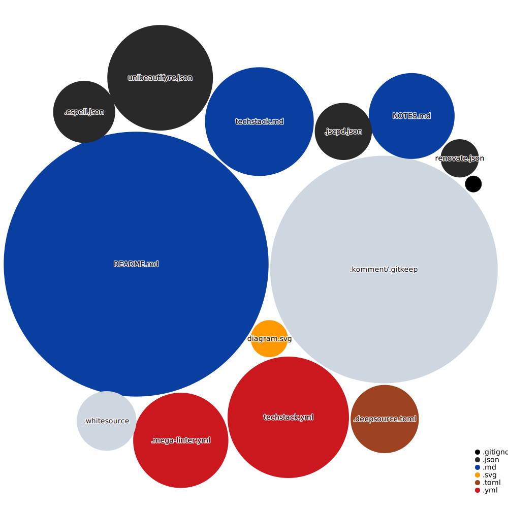

# CodeQuest

## Repository Visualization

<!-- #SECTION -->

<!-- #SECTION -->

## Tech Stack

CodeQuest is built on the following main stack:

-  [GitHub Actions](https://github.com/features/actions) – Continuous Integration

Full tech stack [here](/techstack.md)

<!-- ##SECTION  -->

Repography

##  / Recent activity 

<!-- #SECTION -->

##  / Structure

##  / Top contributors

